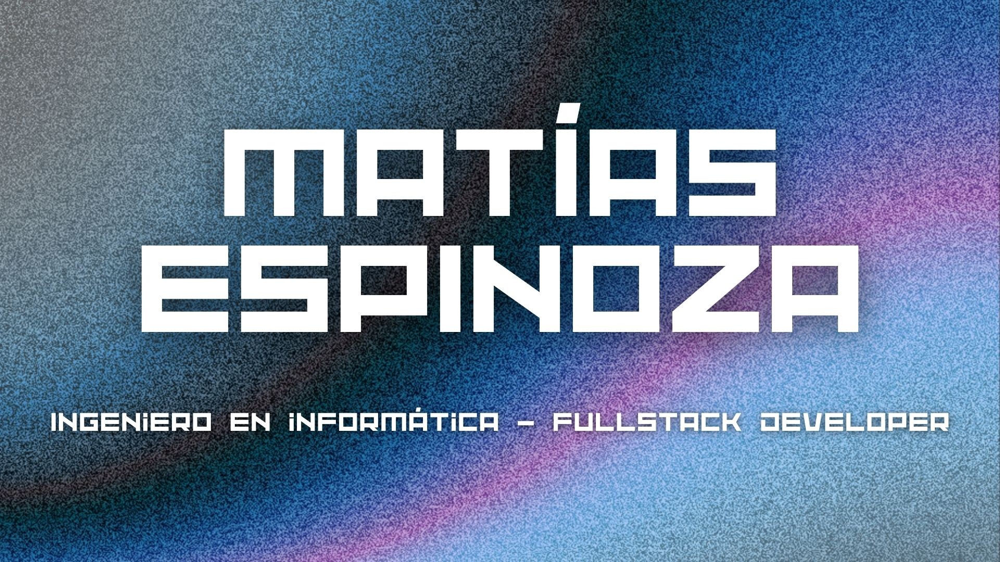

  
  
  

*Bienvenido a mi perfil de GitHub. Me encanta poner a prueba mi creatividad y estar desarrollando cosas.*

---

## Sobre mí

* 🎓 Me titulé de **Ingeniería en Informática en Duoc UC (2025)**.
* 🔭 Actualmente busco oportunidades como desarrollador web y expandir mis conocimientos.
* 🌱 Me encuentro aprendiendo **Angular** y profundizando en mis bases.
* ☁️ Me interesa explorar más sobre **tecnologías Cloud** y el los diferentes servicios que ofrecen.
* 🏁 Mis grandes intereces son el **desarrollo web (Frontend y Backend)**, maquetación, y flujos de trabajo con **metodologías ágiles (Scrum)**.
* 📫 Cómo contactarme: **[matii.espinoza.15@gmail.com](mailto:matii.espinoza.15@gmail.com)**.

---

## Tecnologías y Herramientas

  
  
  
  
  
  
   
  
  

---

## Proyectos Destacados

| Proyecto | Descripción | Enlaces |
| :--- | :--- | :--- |
| **Sistema de gestión de taller mecánico (Pepsico)** | Proyecto de título (Sept. 2025 – Dic. 2025), seleccionado entre los mejores de la generación. Es un sistema integral de gestión de taller y flotas de vehículos con diversos roles para optimizar los tiempos y el flujo de reparaciones. En este proyecto puse a prueba mis habilidades de desarrollo web, UI/UX, conexión a bases de datos y manejo de APIs. | [Demo](Link al demo) |

 

  <i>¡Gracias por visitar mi perfil! No dudes en contactarme si quieres hablar o colaborar en algún proyecto.</i>

